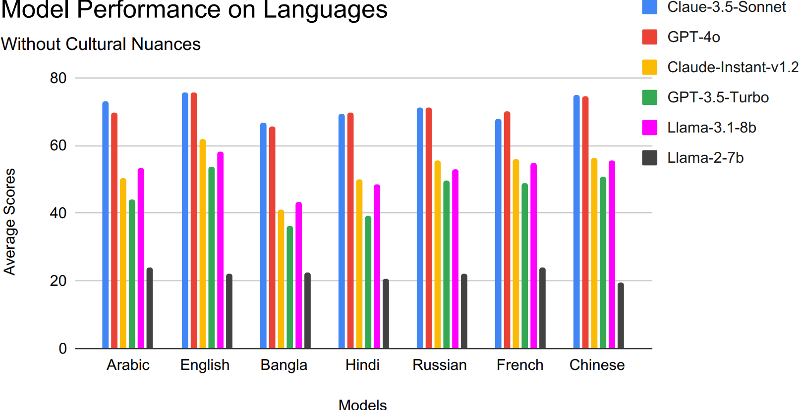

# MultiToM
This is the official repository containing all codes used to generate the results reported in the paper titled **["MultiToM: Evaluating Multilingual Theory of Mind Capabilities in Large
Language Models"](#)**

## Table of Contents

- [MultiToM](#multitom)
    - [Table of Contents](#table-of-contents)
    - [Setup](#requirements)
    - [Dataset](#dataset)
    - [Experiments](#experiments)
    - [Results](#results)
    - [License](#license)
    - [Citation](#citation)


## Setup
For installing the necessary requirements, use the following bash snippet

```bash
$ git clone https://github.com/Jayanta47/Multi-ToM.git
$ cd Multi-ToM
$ python -m venv env
$ source env/bin/activate  # On Windows use `env\Scripts\activate`
$ pip install -r requirements.txt
```

## Dataset

All the used data are avaialble in the `./Data` folder. The original dataset was subsampled and translated into six different languages from `English`. `Arabic`, `French`, `Hindi`, `Bangla`, `Russian`, `Chinese`. The culturally nuanced Dataset was prepared from the original English dataset and translated into the respective languages.

The dataset consists of *502* samples covering *8* tasks and *31* social cognitive abilities in *6* dimensions. Detailed dataset statistics are available in the paper. 


***Figure**: Process of cultural element induction in a
discrepant emotions task. The generic story is culturally
adapted to reflect a Western context. Despite the cultural
modifications, the core narrative remains unchanged*


## Experiments

Six separate state-of-the-art LLMs were used to conduct the experiments and evaluate the Theory-of-Mind capabilities of Multilingual LLMs. They include `Claude-3.5-Sonnet`, `Claude Instant v1.2`, `GPT-4o`, `GPT-3.5-Turbo`, `Llama-3.1-8b Instruct` and `Llama-2-7b Chat`.

Models were tested based on their **Accuracy** in predicting the correct option. The multiple choice answers related to each question were randomized to prevent biased associations.

We used agentic pipelines for the **Translation** and **Nuance Injection** purpose.


***Figure**: Multi-step translation process for MultiToM.
The Data-Handler provides each data point along with
necessary metadata. Agent-1 (GPT-4) translates the data
point into the specified language. Agent-2 (GPT-3.5) reviews the translation, comparing it with the original text and suggesting possible modifications. Finally, Agent-3
(GPT-3.5) refines the translation based on the feedback,
and the Data-Handler saves the final version.*

## Results
Model performances were compared based on the experiments across different languages in both the generic datset and the culturally-nuanced dataset.



***Figure**: Average score comparison of models for each language with and without culturally nuanced dataset.*


## License
Contents of this repository are restricted to non-commercial research purposes only under the [Creative Commons Attribution-NonCommercial-ShareAlike 4.0 International License (CC BY-NC-SA 4.0)](https://creativecommons.org/licenses/by-nc-sa/4.0/). 

<a rel="license" href="http://creativecommons.org/licenses/by-nc-sa/4.0/"></a>

## Citation
If you use any of the datasets or code modules or use our work as a reference, please cite the following paper:
```
To Be Added
```
